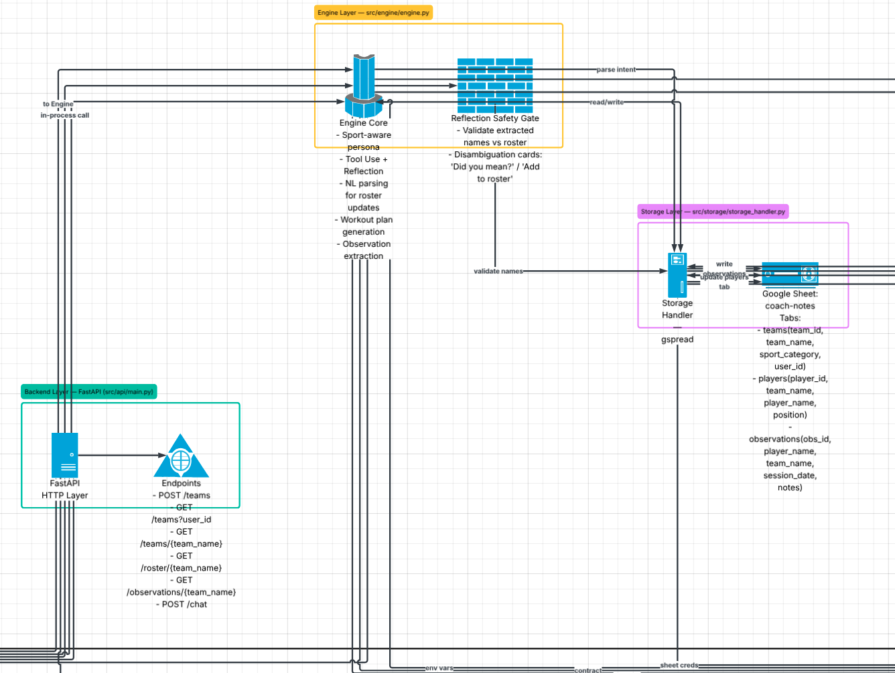
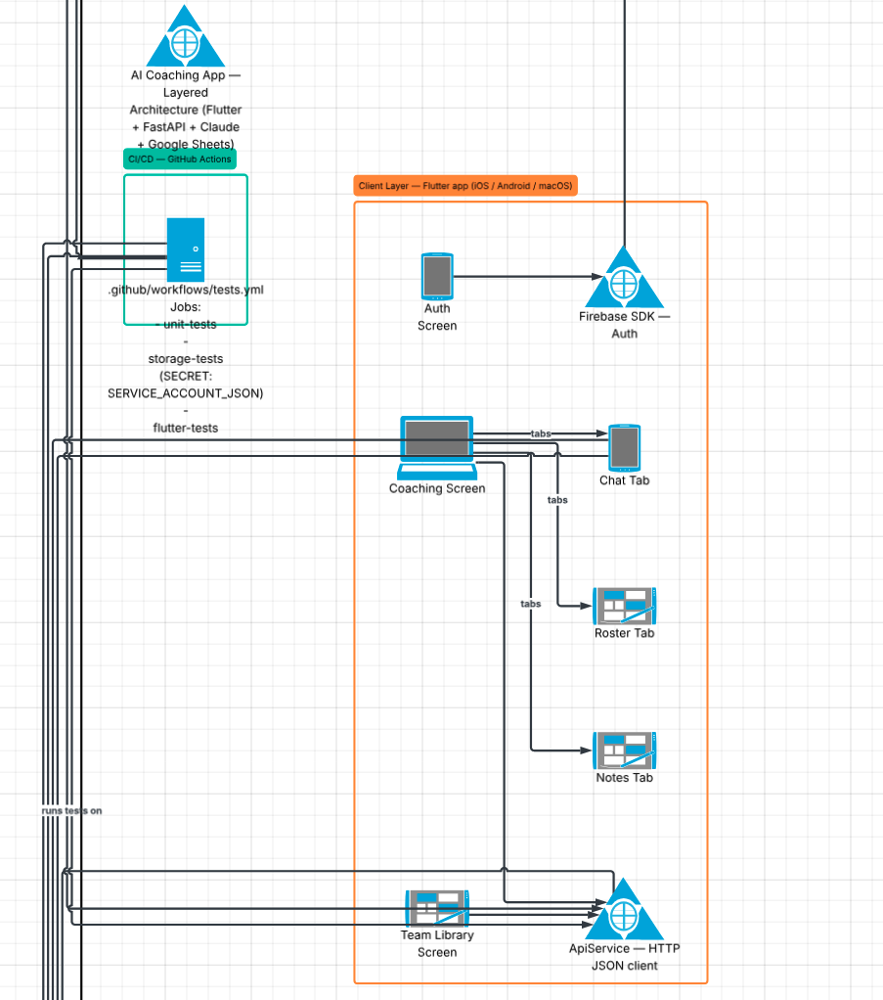
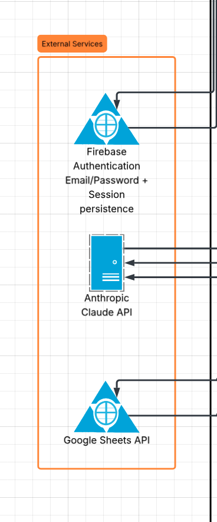

# Coach Notes Organizer

[](https://github.com/UCR-CS180/final-project-kyce-harper/actions/workflows/tests.yml)

An AI-powered coaching app with a Flutter mobile frontend, FastAPI backend, and Claude AI for natural-language understanding. Coaches log into a personal account, manage multiple teams across different sports, and interact with a sport-aware AI assistant through a native mobile interface.

## Video Demo

[](https://youtu.be/E-lBfMEqlEU)

---

## Features

| Feature | Description |
|---|---|
| **Firebase Auth** | Email/password sign in and sign up. Session persists across app restarts. |
| **Team Library** | Each coach sees only their own teams. Create new teams or jump back into an existing one — no re-selecting the sport. |
| **Sport Categories** | Choose from Football, Basketball, Soccer, Baseball, Personal Training, Volleyball, Track, or General. The AI persona adapts to the selected sport. |
| **Player Roster** | Add players by name. Assign positions through natural language ("Set Kyle as point guard"). |
| **Log Practice Notes** | Free-text note dumps — Claude extracts per-player observations and saves them to Google Sheets. |
| **Reflection Safety Gate** | Every player name extracted from a note is validated against the real roster before anything is written. Unrecognized names surface as disambiguation cards with "Did you mean?" and "Add to roster" actions. |
| **Player Summaries** | Ask for a narrative summary of any player's observation history. |
| **Workout Plans** | Ask how to help a player improve — Claude returns a structured plan with exercises, prescriptions, and coach cues. Exercise count defaults to 5 but respects the coach's request. |
| **Notes Tab** | Browse all logged observations grouped by player, with pull-to-refresh. |

---

## Architecture

```
Flutter app (iOS / Android / macOS)
    │
    │  HTTP (JSON)
    ▼
FastAPI  (src/api/main.py)
    │
    ├──► Engine  (src/engine/engine.py)   — Claude AI, Tool Use + Reflection patterns
    │
    └──► Storage (src/storage/storage_handler.py)  — Google Sheets via gspread
```

The three Python layers communicate strictly top-down. The interface layer never touches storage directly. Full contracts in [`CONTRACT.md`](CONTRACT.md).

### UML Diagrams

**Backend, Engine & Storage Layers**



**CI/CD & Client Layer**



**External Services**



---

## Getting Started

### Prerequisites

- Python 3.12+
- Flutter 3.x (`flutter --version` to check)
- A Google Cloud service account with Google Sheets API access
- An Anthropic API key
- A Firebase project (iOS/Android apps registered)

### 1. Clone the repository

```bash
git clone <repo-url>
cd FinalProject
```

### 2. Python backend

**Install dependencies:**
```bash
pip install -r requirements.txt
```

**Environment variables** — create `.env` in `FinalProject/`:
```
ANTHROPIC_API_KEY=your_anthropic_api_key_here
SPREADSHEET_NAME=coach-notes
```

**Google service account** — place `service_account.json` in `FinalProject/`. Share your Google Sheet with the service account email.

### 3. Google Sheets setup

Create a Google Sheet named `coach-notes` with three tabs. Each tab must have exactly these headers in row 1:

**`teams` tab:**
```
team_id | team_name | sport_category | user_id
```

**`players` tab:**
```
player_id | team_name | player_name | position
```

**`observations` tab:**
```
obs_id | player_name | team_name | session_date | notes
```

### 4. Firebase

`flutter_app/lib/firebase_options.dart` is already generated for the project's Firebase instance. If you fork this repo and use your own Firebase project:

```bash
# Install FlutterFire CLI
dart pub global activate flutterfire_cli

# Configure for your project
cd flutter_app
flutterfire configure --project=your-firebase-project-id
```

Enable **Email/Password** sign-in in the Firebase Console under **Authentication → Sign-in methods**.

### 5. Flutter

```bash
cd flutter_app
flutter pub get
```

---

## Running the App

**Start the backend** (from `FinalProject/`):
```bash
uvicorn src.api.main:app --reload
```
The API runs at `http://localhost:8000`. Interactive docs at `http://localhost:8000/docs`.

**Run the Flutter app** (from `flutter_app/`):
```bash
flutter run
```

Select your target device (iOS simulator, Android emulator, or macOS). The app connects to `localhost:8000`.

### App Flow

```
Launch
  ├─ No saved session  →  Sign In / Sign Up screen
  └─ Saved session     →  My Teams (skips login automatically)

My Teams
  ├─ Tap existing team  →  Coaching screen (sport already known — no re-selection)
  └─ "+ New Team"       →  Team creation (name + sport selector)

Coaching screen
  ├─ Chat tab   — AI assistant
  ├─ Roster tab — view / add players
  └─ Notes tab  — all logged observations
```

---

## API Endpoints

| Method | Path | Description |
|---|---|---|
| `POST` | `/teams` | Create a team (team_name, sport_category, user_id) |
| `GET` | `/teams?user_id=xxx` | List all teams belonging to a user |
| `GET` | `/teams/{team_name}` | Get team details (includes sport_category) |
| `GET` | `/roster/{team_name}` | Full player list with positions |
| `GET` | `/observations/{team_name}` | All observations for a team, newest first |
| `POST` | `/chat` | Send a coach message through the AI engine |

---

## Running Tests

### Python — unit tests (no credentials needed)

```bash
cd FinalProject
pytest tests/engine/ tests/interface/ tests/api/ tests/storage/test_storage_unit.py -v
```

### Python — integration tests (requires `service_account.json` + live Google Sheet)

```bash
pytest tests/storage/test_storage.py -v
```

### Flutter

```bash
cd flutter_app
flutter test --reporter=expanded
```

### All Python tests with coverage

```bash
pytest tests/ --cov=src --cov-report=term-missing -v
```

### What each test suite covers

| Suite | File | Type | Mocked? |
|---|---|---|---|
| Engine — Tool Use + Reflection | `tests/engine/test_engine.py` | Unit | Claude + storage |
| Interface — response formatting | `tests/interface/test_interface.py` | Unit | Engine |
| API — all endpoints | `tests/api/test_api.py` | Unit | All storage + engine |
| Storage — new user functions | `tests/storage/test_storage_unit.py` | Unit | gspread |
| Storage — real Sheets | `tests/storage/test_storage.py` | Integration | None |
| Flutter — auth screen UI | `flutter_app/test/auth_screen_test.dart` | Widget | N/A |
| Flutter — API service | `flutter_app/test/api_service_test.dart` | Unit | http.Client |

---

## CI / GitHub Actions

Three jobs run on every push to `main` or `mobile-frontend-ui`, and on pull requests to `main`:

| Job | Tests | Secrets required |
|---|---|---|
| `unit-tests` | Engine + Interface + API + Storage unit (21 tests) | None |
| `storage-tests` | Real Google Sheets integration | `SERVICE_ACCOUNT_JSON` |
| `flutter-tests` | Flutter widget + service tests (8 tests) | None |

---

## Project Structure

```
FinalProject/
├── src/
│   ├── api/
│   │   └── main.py              FastAPI HTTP layer
│   ├── engine/
│   │   └── engine.py            Claude AI — Tool Use + Reflection
│   ├── storage/
│   │   └── storage_handler.py   Google Sheets persistence
│   └── interface/
│       └── cli.py               CLI REPL (original interface)
├── tests/
│   ├── api/
│   │   └── test_api.py          API endpoint unit tests
│   ├── engine/
│   │   └── test_engine.py       Engine unit tests
│   ├── interface/
│   │   └── test_interface.py    Interface unit tests
│   └── storage/
│       ├── test_storage.py      Integration tests (real Sheets)
│       └── test_storage_unit.py Unit tests (mocked gspread)
├── flutter_app/
│   ├── lib/
│   │   ├── main.dart            App entry point + Firebase init + auth routing
│   │   ├── firebase_options.dart
│   │   ├── models/
│   │   │   └── chat_message.dart
│   │   ├── screens/
│   │   │   ├── auth_screen.dart         Sign in / sign up
│   │   │   ├── team_library_screen.dart Per-user team list
│   │   │   ├── team_screen.dart         New team creation
│   │   │   ├── main_screen.dart         Tabbed coaching view
│   │   │   ├── chat_tab.dart            AI chat
│   │   │   ├── roster_tab.dart          Player list
│   │   │   └── notes_tab.dart           Observation history
│   │   └── services/
│   │       └── api_service.dart         HTTP client for backend
│   └── test/
│       ├── auth_screen_test.dart
│       ├── api_service_test.dart
│       └── widget_test.dart
├── .github/workflows/tests.yml
├── requirements.txt
├── pytest.ini
├── CONTRACT.md
└── FUNCTIONALITY.md
```

---

## Testing Patterns

Tests follow the conventions established in CS180 Labs 6 and 7:

- **Patch where USED** (Lab 6) — mock targets are the import site in the module under test, not the definition site. E.g., `src.api.main.save_team`, not `src.storage.storage_handler.save_team`.
- **Dependency injection** (Lab 7) — `ApiService.getTeamsForUser` and `createOrGetTeam` accept an optional `http.Client` parameter so tests inject a `MockClient` without touching a real server.
- **No shared fixtures** — `conftest.py` is empty; each test sets up its own mocks inline.
- **Status-based assertions** — engine and API return dicts always include a `status` key; tests assert on that first.
